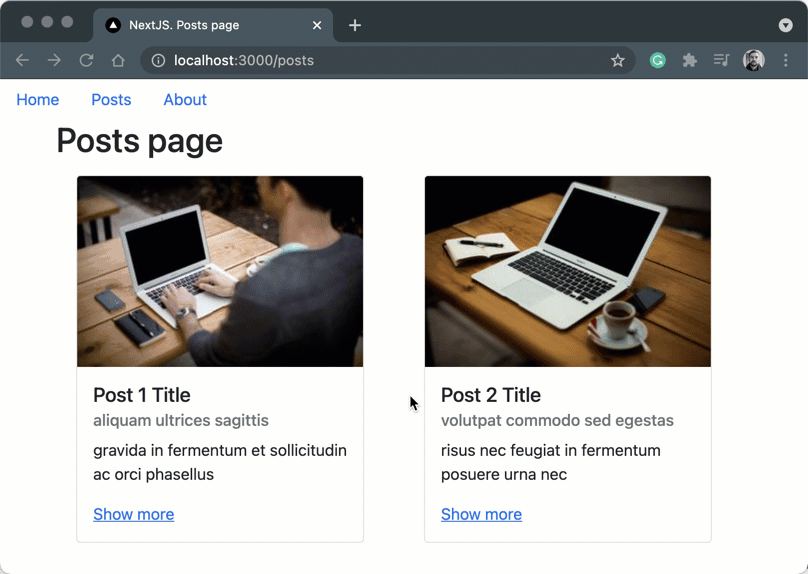
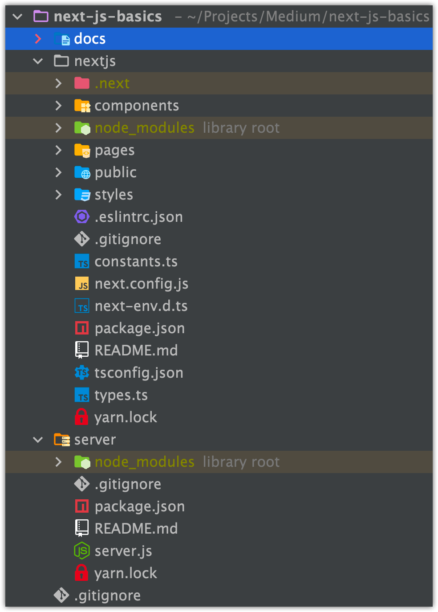

# Next.js + Express server

## How this project was created

[Link to Medium](http://example.com)

## How to start this project

1. Run `yarn start` in `/server` folder
2. Run `yarn dev` in `/nextjs` folder

